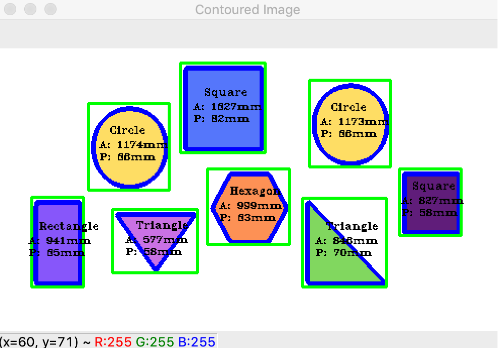

# Shape-Detection

# Description
Created a program that takes in an image of random shapes and is able to determine the name of the shape along with its area and perimeter in millimeters.

# Code Requirements
- Must have Python 3.7 
- Must have the OpenCV library installed

# Original Image

# Image Produced

